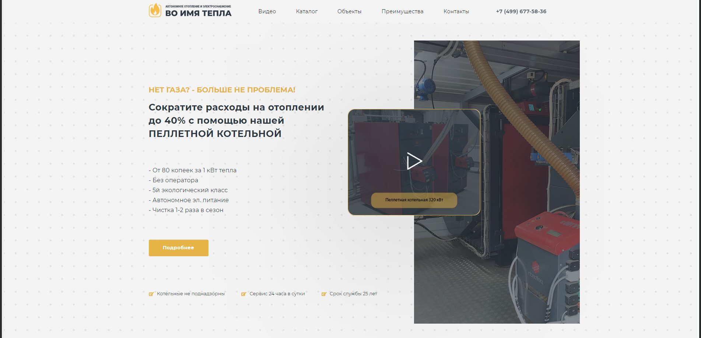

# Котел на пеллетах
Рекламный лендинг для компании, занимающейся продажей и монтажом пеллетых котлов.



## Установка
1. Создайте клон репозитория и установите зависимости командой:

```
$ npm install
```
1.1 При возникновении ошибки, удалите папку **node_modules**, файл **package-lock.json** и выполните команду:

```
$ npm i --legacy-peer-deps
```

2. Cоберите продакшн-бандл:

```
$ npm run build
```

3. Запустите сервер:

```
$ npm run start
```

##Используемые технологии
* Flexbox
* Grid
* Медиазапросы
* БЭМ
* Webpack
